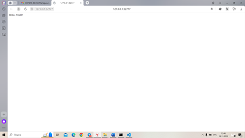
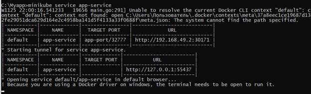
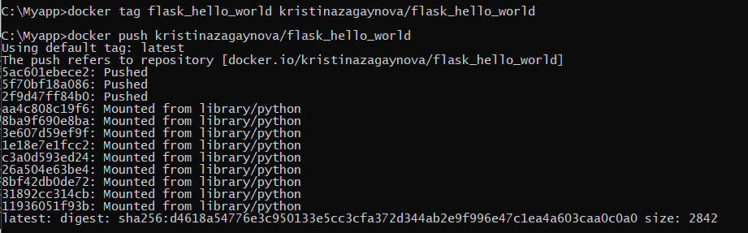
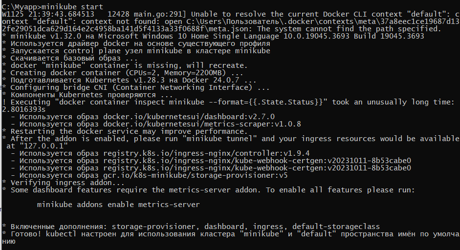
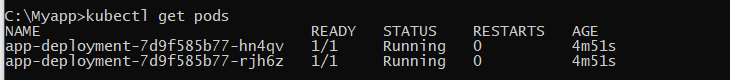
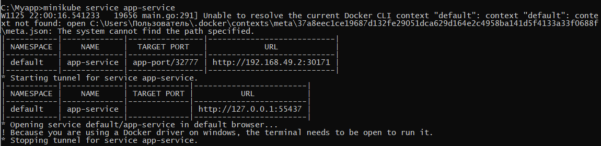
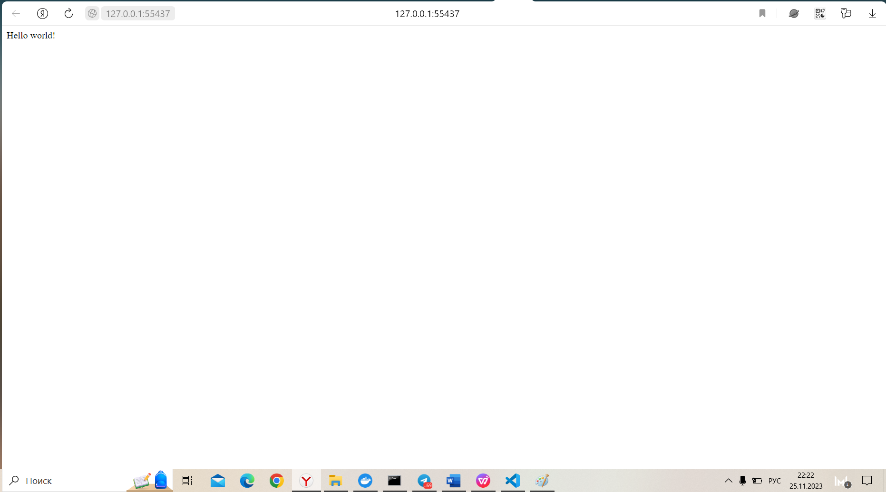

# FlaskAppK8s
# Тестовое задание BIOCAD
# Загайнова Кристина

## Задание:

- Создать веб приложение “hello world” на любом языке программирования, которое должно работать на порту 32777;
- Установить Docker на рабочий компьютер;
- Собрать контейнер с вашим приложением и опубликовать его на Docker Hub;
- Установить Minikube используя оригинальную инструкцию. После установки необходимо развернуть minikube cluster;
- Вам необходимо создать deployment с 2 репликами вашего приложения;
- Создать сервис, через который у вас будет доступ на эти "поды". Выбор типа сервиса остается на ваше усмотрение;
- Запустить в minikube режим проброса портов и подключиться к вашим контейнерам через веб браузер;
- Опубликовать работу в открытом гит репозитории.

## Ход работы

Для работы нам потребуются:

- Docker Engine – для создания образа Docker и контейнеров
- kuberctl – для запуска команд для кластеров Kubernetes
- Minikube – для запуска Kubernetes на локальной машине


### Создание приложения
Напишем простое веб-приложение, работающее на порту 32777 при помощи серверного фреймворка Flask, и проверим его работоспособность и доступность. 
```
from flask import Flask
import os

app = Flask(__name__)

@app.route("/")
def hello():
    return "Hello world!"

if __name__ == "__main__":
    port = int(os.environ.get("PORT", 32777))
    app.run(debug=True,host='0.0.0.0',port=port)
```
<br><br/>
### Создание образа
Установим Docker и соберем контейнер с нашим приложением. Для этого напишем Dockerfile, в котором установим необходимые зависимости и пропишем команду для запуска. 
```
FROM python:3.6
COPY . /app
WORKDIR /app
RUN pip install -r requirements.txt
ENTRYPOINT ["python"]
CMD ["myapp.py"]
```
<br><br/>
Опубликуем образ на <a href="https://hub.docker.com/repository/docker/kristinazagaynova/flask_hello_world/general" target="_blank">DockerHub</a> 
<br><br/>

### Работа с minikube

Создадим кластер minikube
> minikube start
<br><br/>

Создадим YAML-файл, в котором опишем Deployment – ресурс Kubernetes, предназначенный для развертывания приложений и их обновления декларативным образом. 

```

apiVersion: apps/v1
kind: Deployment
metadata:
  name: app-deployment
spec:
  replicas: 2
  selector:
    matchLabels:
      app: app
  template:
    metadata:
      labels:
        app: app
    spec:
      containers:
      - name: app
        image: kristinazagaynova/flask_hello_world
        ports:
        - containerPort: 32777


```

В кофигурационном файле мы задали количество реплик (2 штуки) и метки для подов, соответствующих шаблону.
Применим конфигурационный файл развертывания:
> kubectl apply -f deployment.yaml

По умолчанию под доступен только при обращении по его внутреннему IP-адресу внутри кластера Kubernetes. Чтобы сделать контейнер доступным вне виртуальной сети Kubernetes, необходимо представить под как Service Kubernetes. Создадим YAML-файл, в котором его опишем

```

apiVersion: v1
kind: Service
metadata:
  name: app-service
spec:
  ports:
    - name: app-port
      protocol: TCP
      port: 32777
      targetPort: 32777
  selector:
    app: app
  type: NodePort

```

Возьмем тип сервиса NodePort, поскольку он простот в настройке и использовании, а необходимости в масштабировании или равномерном распределении нагрузки у нас нет

Применим:

> kubectl apply -f service.yaml

### Проверка работоспособности

Запустим сервис.
Посмотрим список запущенных подов
<br><br/>

> minikube service app-service
<br><br/>

Проверим работоспособность.
<br><br/>
